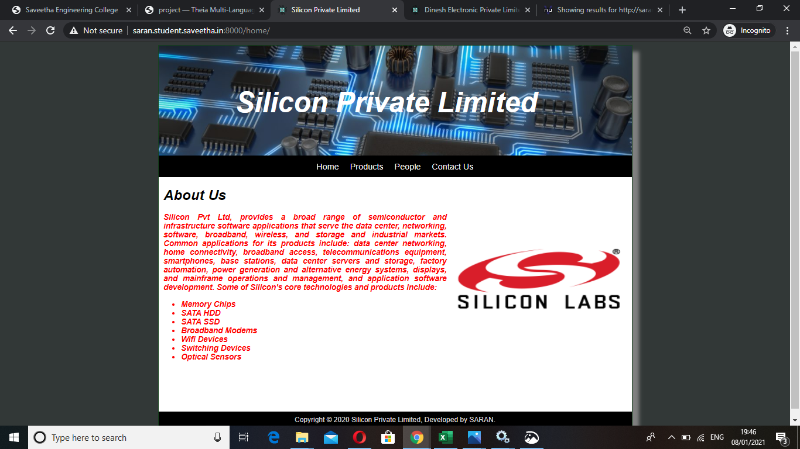
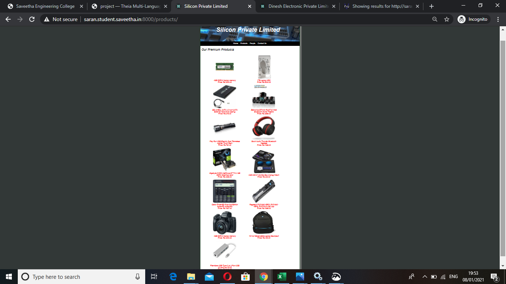
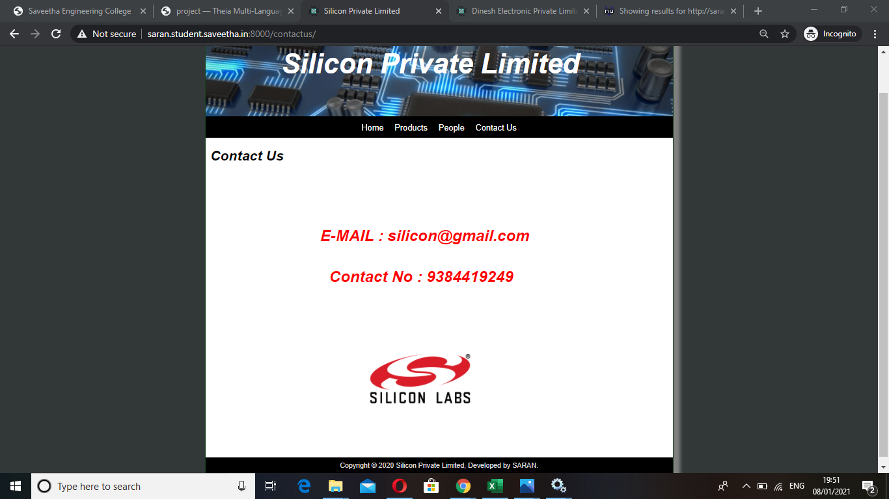
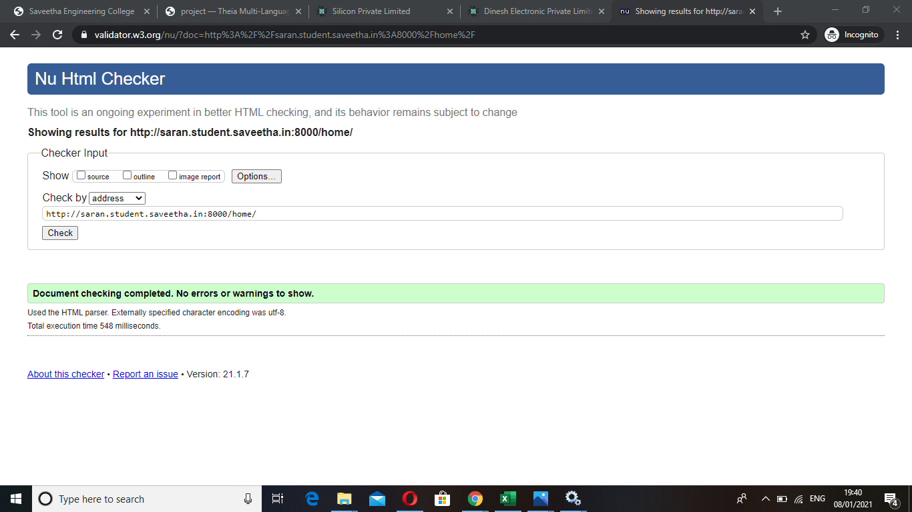
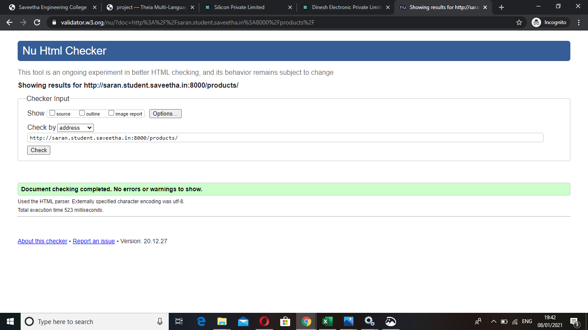
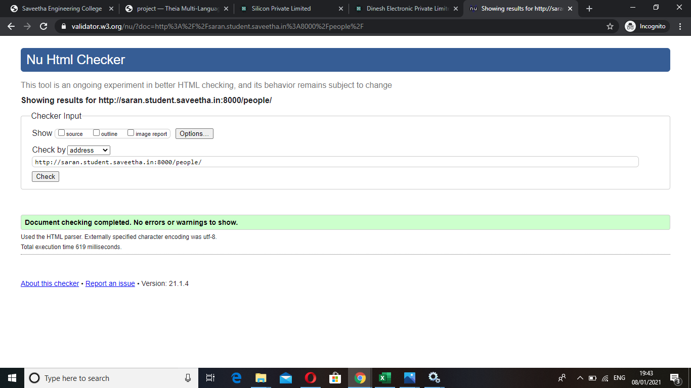

# Web Design for a Manufacturing Company
## AIM: 
To design a static website for a chip manufacturing company.

## DESIGN STEPS:
### Step 1: 
Requirement collection.
### Step 2:
Creating the layout using HTML and CSS.
### Step 3:
Updating the sample content.
### Step 4:
Choose the appropriate style and color scheme.
### Step 5:
Validate the layout in various browsers.
### Step 6:
Validate the HTML code.
### Step 6:
Publish the website in the given URL.

## PROGRAM:

### base.html
```

<!DOCTYPE html>
<html lang="en">

<head>
    <title>Silicon Private Limited</title>
    <link rel="stylesheet" href="">
    <link rel = "icon" href ="" type = "image/x-icon"> 
              
</head>

<body>
    <div class="container">
    <div class="banner">
       <h1> Silicon Private Limited</h1>
    </div>
    <div class="menu">
        <div class="menuitem"><a href="/home">Home</a></div> 
        <div class="menuitem"><a href="/products">Products</a></div> 
        <div class="menuitem"><a href="/people">People</a></div>
        <div class="menuitem"><a href="/contactus">Contact Us</a></div> 
    </div><div class="content">
        
    
    </div>
    <div class="footer">
        Copyright © 2020 Silicon Private Limited, Developed by SARAN.
    </div>
    </div>
</body>

</html>
```

### home.html
```



    <div class="homecontent">    
    <h1>About Us</h1>
    
    <div class="contenttext">
    Silicon Pvt Ltd, provides a broad range of semiconductor and infrastructure software applications that serve the data center, networking, software, broadband, wireless, and storage and industrial markets. Common applications for its products include: data center networking, home connectivity, broadband access, telecommunications equipment, smartphones, base stations, data center servers and storage, factory automation, power generation and alternative energy systems, displays, and mainframe operations and management, and application software development. Some of Silicon's core technologies and products include:
    <ul>
        <li>Memory Chips</li>
        <li>SATA HDD</li>
        <li>SATA SSD </li>
        <li>Broadband Modems</li>
        <li>Wifi Devices</li>
        <li>Switching Devices</li>
        <li>Optical Sensors</li>
    </ul>
    </div>
    </div>

```
### products.html
```



    <div class="productcontent">    
    <h1>Our Premium Products</h1>
    <div class="productitems">
        <div class="productitem"> 
            <div class="itemimage">
            
            </div>
            <div class="itemname">4GB DDRA4 laptop memory</div>
            <div class="itemprice">Price: Rs.2000.00 </div>
        </div>
        <div class="productitem"> 
            <div class="itemimage">
            
            </div>
            <div class="itemname">1TB Laptop HDD</div>
            <div class="itemprice">Price: Rs.5000.00 </div>
        </div>
        <div class="productitem"> 
            <div class="itemimage">
            
            </div>
            <div class="itemname">SEA SHELL SATA 2.5 inch SATA External hard drive Casing</div>
            <div class="itemprice">Price: Rs.379.00 </div>
        </div>
        <div class="productitem"> 
            <div class="itemimage">
            
            </div>
            <div class="itemname">Zebronics BT4440 RUCF 60 Watt Bluetooth Home Theatre</div>
            <div class="itemprice">Price: Rs.2999.00 </div>
        </div>
        <div class="productitem"> 
            <div class="itemimage">
            
            </div>
            <div class="itemname">Play Run USB Electric Dual Flameless Lighter Torch Rech</div>
            <div class="itemprice">Price: Rs.794.00 </div>
        </div>
        <div class="productitem"> 
            <div class="itemimage">
            
            </div>
            <div class="itemname">Boult Audio Thunder Bluetooth Headset</div>
            <div class="itemprice">Price: Rs.1299.00 </div>
        </div>
        <div class="productitem"> 
            <div class="itemimage">
            
            </div>
            <div class="itemname">Gigabyte NVIDIA GeForce GT 710 2 GB DDR3 Graphics Card</div>
            <div class="itemprice">Price: Rs.3299.00 </div>
        </div>
        <div class="productitem"> 
            <div class="itemimage">
            
            </div>
            <div class="itemname">CSD-255-21 Combo Box Analog Watch </div>
            <div class="itemprice">Price: Rs.330.00 </div>
        </div>
        <div class="productitem"> 
            <div class="itemimage">
            
            </div>
            <div class="itemname">Casio FX-991ES Plus-2nd Edition Scientific Scientific </div>
            <div class="itemprice">Price: Rs.1087.00 </div>
        </div>
        <div class="productitem"> 
            <div class="itemimage">
            
            </div>
            <div class="itemname">Regatech PA5108U-1BRS, PA5109U-1BRS, PA5110U 6 Cell Lap</div>
            <div class="itemprice">Price: Rs.1699.00 </div>
        </div>
        <div class="productitem"> 
            <div class="itemimage">
            
            </div>
            <div class="itemname">4GB DDRA4 laptop memory</div>
            <div class="itemprice">Price: Rs.2000.00 </div>
        </div>
        <div class="productitem"> 
            <div class="itemimage">
            
            </div>
            <div class="itemname">15 inch Expandable Laptop Backpack</div>
            <div class="itemprice">Price: Rs.450.00 </div>
        </div>
        <div class="productitem"> 
            <div class="itemimage">
            
            </div>
            <div class="itemname">Pitambara USB Type C to 3 Port USB 3.0 and Lan RJ45 </div>
            <div class="itemprice">Price: Rs.1249.00 </div>
        </div>
    </div>
    </div>

```
### people.html
```



    <div class="productcontent">    
    <h1>Our Peoples</h1>
    <div class="productitems">
        <div class="productitem"> 
            <div class="itemimage">
            
            </div>
            <div class="itemname">sanjay V</div>
            <div class="itemprice">Company Head </div>
        </div>
        <div class="productitem"> 
            <div class="itemimage">
            
            </div>
            <div class="itemname">Dhinesh v</div>
            <div class="itemprice">Company account Executive Agency </div>
        </div>
        <div class="productitem"> 
            <div class="itemimage">
            
            </div>
            <div class="itemname">Anburaj k</div>
            <div class="itemprice">Company Account Manager </div>
        </div>
        
        <div class="productitem"> 
            <div class="itemimage">
            
            </div>
            <div class="itemname">Ajay D</div>
            <div class="itemprice">Ajency Development Manager </div>
        </div>
        <div class="productitem"> 
            <div class="itemimage">
            
            </div>
            <div class="itemname">Harikrishnan V</div>
            <div class="itemprice">Bussiness Development Manager </div>
        </div>
  
      
        <div class="productitem"> 
            <div class="itemimage">
            
            </div>
            <div class="itemname">Parthiban S </div>
            <div class="itemprice">Program Manager </div>
        </div>
    </div>
    </div>

```
### contactus.html
```



    <div class="productcontent">    
    <h1>Contact Us</h1> 
    <div class="productitems">
        <div class="productitem"> 
            <div class="contactname"><h1>E-MAIL : silicon@gmail.com</h1></div>
            <div class="contactprice"><h1> Contact No : 9384419249 </h1></div>
        </div>
        <div class="productitem"></div>
        <div class="productitem"> 
            <div class="contactimage">
            
            </div>
        </div>
    </div>
    </div> 

```
## OUTPUT:







## CODE VALIDATION REPORT:







## RESULT:
Thus a website is designed for the chip manufacturing company and is hosted in the URL http://saran.student.saveetha.in:8000/. HTML code is validated.